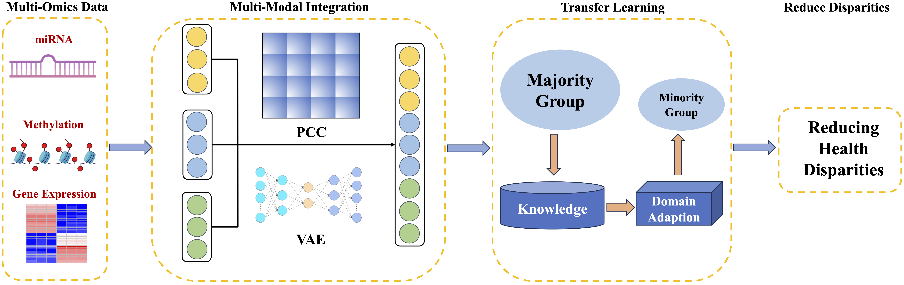

# MOTLPRAD: A Multi-Modal Transfer Learning Framework to Reduce Health Disparities in Prostate Adenocarcinoma

## Overview

MOTLPRAD (Multi-Omics integration Transfer Learning framework for PRAD) is a framework designed to reduce health disparities in prostate adenocarcinoma (PRAD) prediction. Specifically, we first investigated two multi-modal ensemble methods, Pearson correlation coefficient (PCC) based patient-pairwise similarity and variational autoencoder (VAE), to integrate different types of omics data. Then, we adopted a transfer learning model based on domain adaptation to pre-train the model on the majority group (e.g., non-Hispanic White Americans) and fine-tune the model using the minority group (e.g., Black Americans). To mitigate data imbalance across different ethnic groups, we leveraged the Synthetic Minority Oversampling Technique (SMOTE) to augment the sample size of minority groups, which could further improve the performance of reducing health disparities in PRAD. 

## Flowchart of MOTLPRAD


## Table of Contents
- [Requirements](#Requirements)
- [Installation](#Installation)
- [Usage](#Usage)
- [Bug Report](#Bug-Report)
- [Authors](#Authors)
- [Publication](#Publication)
- 
## Requirements

### Python Dependencies

- Python 3.9
- **Deep Learning Frameworks**:
  - Theano
  - Lasagne
  - TensorFlow (>= 2.0)
  - Keras
- **Data Processing**:
  - NumPy
  - Pandas
  - scikit-learn
  - scipy
- **Additional Libraries**:
  - openpyxl 
  - pickle
 
## Installation

1. Clone the repository:
```bash
git clone 
cd MOTLPRAD-main
```

2. Install required dependencies:
```bash
pip install numpy pandas scikit-learn scipy tensorflow keras theano lasagne openpyxl
```

**Note**: Theano and Lasagne are legacy frameworks. For newer systems, you may need to use specific versions or consider migrating to TensorFlow/Keras equivalents.

## Usage

### Basic Workflow

1. **Prepare your data**: Ensure you have the required Excel files and your feature data in CSV format.

2. **Run experiments**:
```bash
python MOTLPRAD.py
```
3. **Output**:

The framework generates:
- **Excel files** with cross-validation results containing AUC scores for different models and population groups
- **Summary statistics** (mean and standard deviation) across multiple random seeds
- **Pickle files** containing prediction scores for further analysis

Example output files:
- `PRAD-AA-EA-integration_mRNA_Methy_VAE-PFI-3YR.xlsx`
- `summary-PRAD-integration_mRNA_Methy_VAE-PFI-3YR.xlsx`
- `score_dict_exp.pkl`

## Bug Report

If you find any bugs or problems, or you have any comments on RanBALL, please don't hesitate to contact via email lli@unmc.edu or [Issues](https://github.com/wan-mlab/MOTLPRAD/issues).

## Authors
Lusheng Li, Shibiao Wan

## Publication
A Multi-Modal Transfer Learning Framework to Reduce Health Disparities in Prostate Adenocarcinoma
Lusheng Li, Jieqiong Wang, Shibiao Wan
bioRxiv 2025.12.15.694538; doi: https://www.biorxiv.org/content/10.64898/2025.12.15.694538v1

## License 

[](https://www.gnu.org/licenses/gpl-3.0)

GNU GENERAL PUBLIC LICENSE  
Version 3, 29 June 2007

This program is free software: you can redistribute it and/or modify
it under the terms of the GNU General Public License as published by
the Free Software Foundation, either version 3 of the License, or
(at your option) any later version.

This program is distributed in the hope that it will be useful,
but WITHOUT ANY WARRANTY; without even the implied warranty of
MERCHANTABILITY or FITNESS FOR A PARTICULAR PURPOSE.  See the
GNU General Public License for more details.

You should have received a copy of the GNU General Public License
along with this program.  If not, see <https://www.gnu.org/licenses/>.
